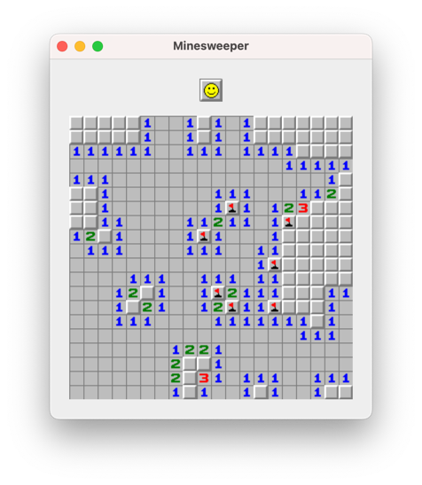

# Minesweeper Game

This is an implementation of the [Minesweeper](https://en.wikipedia.org/wiki/Minesweeper_(video_game)) game in Kotlin and Compose Multiplatform. 

Tech stack:

- Kotlin
- [Compose Multiplatform](https://github.com/JetBrains/compose-multiplatform) - declarative UI
- [Decompose](https://github.com/arkivanov/Decompose) - navigation and lifecycle
- [MVIKotlin](https://github.com/arkivanov/MVIKotlin) - state management
- [kotlinx-serialization](https://github.com/Kotlin/kotlinx.serialization) - state saving and restoration

Supported targets: Desktop (JVM) and Wasm Browser.

Running desktop app: `./gradlew :composeApp:run`

Wasm browser app: https://arkivanov.github.io/Minesweeper

Controls:

- Left mouse button - dig a cell
- Right mouse button - flag a cell
- Middle mouse button (or both left and right buttons simultaneously) - dig all unflagged adjacent cells

Known issues:

- The browser app recognizes all mouse buttons as left.
- The cursor is not working in settings text fields in the browser app.
- Cells may be misclicked in the browser app on mobile devices.

Screenshots:

